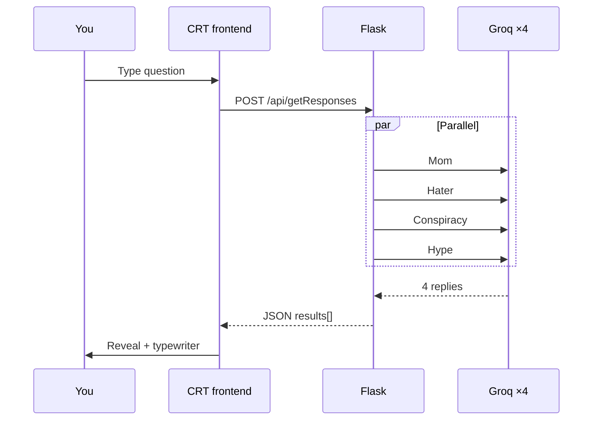
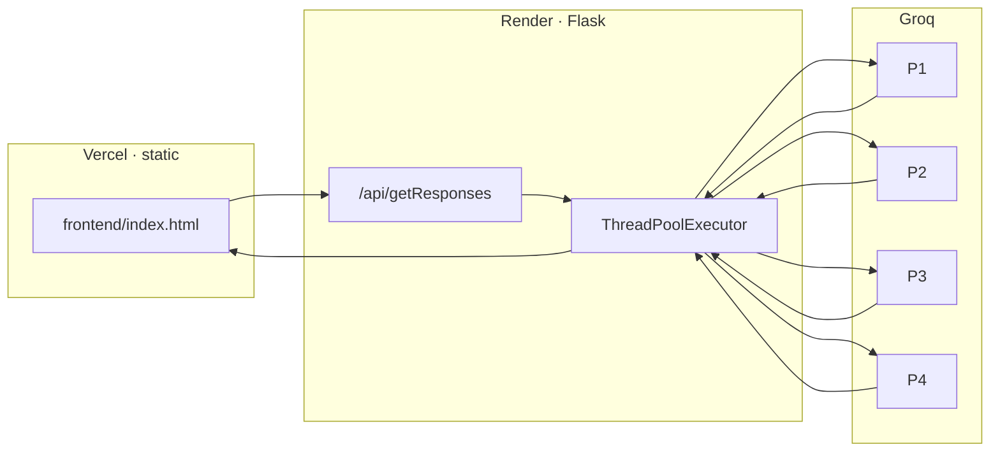
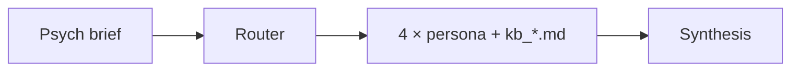

<h1 align="center">Depth AI Council</h1>

<p align="center">
  <a href="https://depth-chi.vercel.app"></a>
  
  
  
  
</p>

<p align="center">
  <strong>Ask once → four AI personas roast you in parallel</strong><br/>
  <sub>CRT terminal UI · hostile 4th-wall hooks · built around free-tier API limits</sub>
</p>

<br/>

<p align="center" width="100%">
  <video src="https://github.com/user-attachments/assets/fe68a8a8-42df-468a-845d-d45d26a3c447"
    poster="demo.webp"
    width="80%"
    controls
    loop
    muted
    playsinline
    style="max-width: 720px; border-radius: 12px; border: 1px solid #27272a; box-shadow: 0 8px 32px rgba(0,0,0,.45);">
  </video>
</p>

<p align="center">
  <a href="https://depth-chi.vercel.app"><strong>Open the live app →</strong></a>
  &nbsp;·&nbsp;
  <a href="#local-run">Run locally</a>
  &nbsp;·&nbsp;
  <a href="docs/performance-notes.md">Performance notes</a>
</p>

---

## At a glance

<table>
<tr>
<td width="33%" valign="top">

**Product**

One-shot “Roast Council”: type a question, get four contradictory takes in a retro terminal — Mom, Hater, Conspiracist, Hype.

</td>
<td width="33%" valign="top">

**Engineering**

`ThreadPoolExecutor` fires four Groq calls at once. Per-call timeouts, `max_tokens` caps, and fallbacks so one failure does not 500 the batch.

</td>
<td width="33%" valign="top">

**UX**

No streaming → loading is **designed** (boot, scanlines, malware reveal, typewriter). Idle/paste/DevTools hooks keep a stateless page feeling alive.

</td>
</tr>
</table>

---

## Demo flow



---

## Architecture



<details>
<summary><strong>Serious mode</strong> — <code>POST /council/debate</code> (4-stage pipeline + KB)</summary>



Slower, structured advice (Marcus / Alex / Maya / Turing). See `frontend/cf/depth-ai-council-final.html` for the calmer UI iteration.

</details>

---

## Personas

| | Persona | Vibe |
|:---:|:---|:---|
| 💗 | **Worried Mom** | Everything is a health crisis |
| 🔥 | **The Hater** | Two sentences, maximum damage |
| 👁 | **Conspiracist** | Your idea is part of the plot |
| ⚡ | **Hype Man** | To the moon, facts optional |

---

## Project structure

```
mentor/
├── demo.mp4 · demo.webp     # README media
├── index.html               # → redirects to frontend/
├── frontend/
│   ├── index.html           # Roast Council (live)
│   └── cf/                  # Serious-council prototypes
├── backend/
│   ├── app.py
│   ├── persona.json
│   └── kb_*.md
└── docs/
    └── performance-notes.md
```

---

## Local run

**Backend**

```bash
cd backend
pip install -r requirements.txt
cp .env.example .env    # add GROQ_API_KEY
python app.py           # http://localhost:5000
```

**Frontend** (repo root)

```bash
python -m http.server 8080
```

Open **http://localhost:8080/** → redirects to the app.

> **API URL:** `frontend/index.html` points at the **production** Render host by default. For local API testing, set `fetch` to `http://localhost:5000/api/getResponses`.

<details>
<summary><strong>API reference</strong></summary>

| Method | Path | Use |
|--------|------|-----|
| `POST` | `/api/getResponses` | Roast — fast, parallel |
| `POST` | `/council/debate` | Full pipeline |
| `GET` | `/health` | Status |
| `GET` | `/usage` | Token budget |

</details>

---

## Why it looks like this

| Constraint | Design choice |
|--------------|----------------|
| Groq free tier | Short replies, single-shot, parallel batch |
| No database | One question → four answers, then done |
| Batch response (no SSE) | Fake boot + “malware” reveal instead of a spinner |
| Render cold start | Boot sequence covers spin-up |

---

## Story (short)

Started as a **multi-turn mental-health council** with persistent memory. Hit **rate limits** and **UX overload** (four long agents at once). Pivoted to a **structured debate pipeline** (`/council/debate`), then shipped the **Roast Council** as the public face: same parallel backend pattern, UI that owns the chaos.

Built as a **portfolio piece** — honest scope, live deploy, constraint-driven design — not enterprise cosplay.
